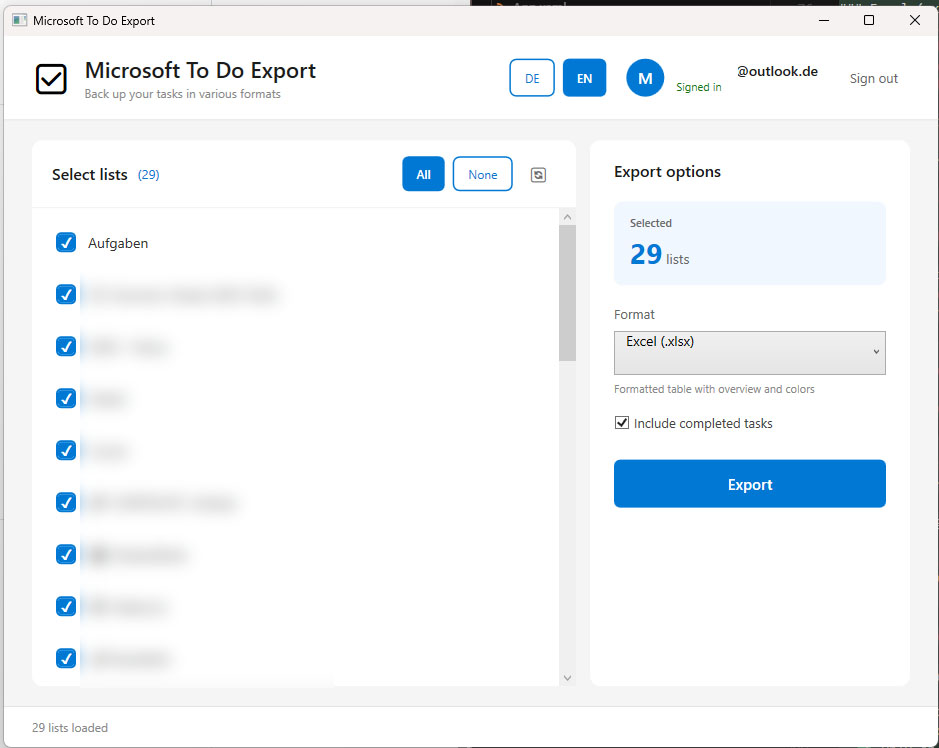

# Microsoft To Do Export

A user-friendly Windows application to export your Microsoft To Do lists to various formats.

## 🚀 Quick Start

1. **Download**: Download the ZIP file and extract it
2. **Run**: Double-click `TodoExport.exe`
3. **Sign In**: Click "Sign in" and follow the instructions
4. **Export**: Select your lists and export them

**No installation required!** The application includes everything needed.

## ✨ Features

- ✅ **Easy Sign-In** - One click, browser opens automatically
- 🔐 **Secure Login** - Your login is securely saved
- 🌐 **German & English** - Switch language with one click
- 📋 **Multi-Select** - Select multiple lists at once
- 📊 **6 Export Formats**:
  - **Excel (.xlsx)** - Formatted spreadsheets with colors and overviews
  - **Todoist CSV** - Compatible with Todoist import
  - **JSON** - Structured format for developers
  - **Text (.txt)** - Simple text list
  - **Detailed Text** - With all information and icons
  - **Detailed CSV** - All details as a table
- ✅ **Completed Tasks** - Optionally include or exclude
- 🔄 **Refresh** - Update lists with one click

## 📋 System Requirements

- **Windows 10 or Windows 11**
- **Microsoft account** with Microsoft To Do
- **No additional installation** - Everything is included!

## 📥 Installation

1. Download the latest version: `TodoExport-v1.0.1-win-x64.zip`
2. Extract the ZIP file to a folder of your choice
3. Run `TodoExport.exe`

That's it! No installation, no configuration.

## 📖 Usage

### 1. Sign In

1. Click the **"Sign in"** button
2. A browser window opens automatically
3. Enter the displayed code
4. Sign in with your Microsoft account
5. Grant the required permissions
6. Done! Your login will be saved for future sessions

### 2. Select Lists

- All your To-Do lists are loaded automatically
- Use **"All"** to select all lists
- Use **"None"** to deselect all
- Check/uncheck individual lists as needed
- The number of selected lists is displayed in real-time

### 3. Export

1. Select the **export format** from the dropdown menu
2. **(Optional)** Check/uncheck **"Include completed tasks"**
3. Click **"Export"**
4. Choose the save location for the export file
5. Done! You'll receive a confirmation

## 📊 Export Formats

### Excel (.xlsx) - Recommended for most users
- Formatted spreadsheet with overview
- Color-coded status indicators
- Separate sheets for each list
- Formatted dates and times

### Todoist CSV (.csv)
- Compatible with Todoist import function
- Perfect for migrating to Todoist

### JSON (.json)
- Structured format with all metadata
- Ideal for developers and further processing

### Text (.txt)
- Simple, readable text list
- Quick overview

### Detailed Text (.txt)
- All information with icons
- Notes, due dates, categories
- Ideal for archiving

### Detailed CSV (.csv)
- All properties as a table
- Perfect for data analysis

## 🌐 Language

The application supports two languages:
- **German (DE)** - Full German translation
- **English (EN)** - Default language

Switch language with the **DE/EN** toggle in the top-right corner.

## 🔒 Privacy & Security

- ✅ Uses **official Microsoft authentication** (MSAL)
- ✅ Your **credentials are never stored**
- ✅ Only an encrypted authentication token is stored locally
- ✅ The app only requests **read permissions** - no modifications possible
- ✅ **No data** is sent to third-party servers
- ✅ **Local storage only** - All data stays on your computer
- ✅ **Windows DPAPI encryption** - Tokens are user- and machine-specific encrypted

### Required Permissions:
- `Tasks.Read` - Read your To Do lists (for export only)
- `User.Read` - Display your name
- `offline_access` - Automatic re-login (optional)

## ❓ Frequently Asked Questions

### "Sign-in failed"
- Make sure you have an active internet connection
- Check if your Microsoft account has access to Microsoft To Do
- Try signing out and signing in again

### "No lists found"
- Ensure you're using Microsoft To Do
- Check if you're signed in with the correct account
- System lists (e.g., "Flagged Email") are automatically filtered out

### "Export fails"
- Ensure you have write permissions for the chosen location
- Check if sufficient disk space is available
- Try selecting fewer lists if you have many tasks

### "Token cache issues"
- If you experience persistent login issues, you can clear the token cache
- The cache is located at: `%LocalAppData%\TodoExport\`
- Delete the `todo_export_cache.bin` file to reset authentication

## 🆘 Support

If you have problems or questions:
- Open an issue on GitHub
- Check the full documentation on the project's GitHub page

## 📝 License

This project is licensed under the MIT License.

## ⚠️ Note

This project is an unofficial solution and is not connected to Microsoft or Todoist.

---

**Version 1.0.1** | Made with ❤️ for everyone who wants to easily backup their tasks.
